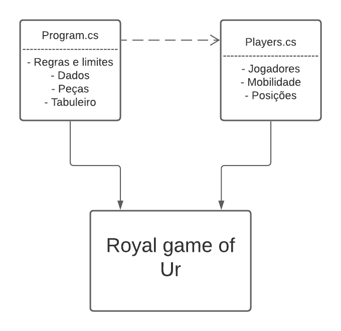

# **Royal Game of Ur**

### Grupo de trabalho:

 André Leandro 22003581

> Programador do código

 Luana Sousa 22007125

> Organizadora do projeto

### Repositório Git

https://github.com/Luana-22007125/Royal-Game-of-Ur

### Arquitetura

###### Solução

O programa é dividido em duas classes, uma para o código do jogo e das suas funções chamada Program, e uma para as definições especifícas dos jogadores chamada Players.
O código Program está organizado pelas regras e limites do jogo em primeiro lugar, depois a criação dos dados, das peças e do tabuleiro.
O código Players está organizado por ordem de jogo, sendo primeiro criados os jogadores, depois a sua mobilidade e a sua posição final.

###### Diagrama UML

### Referências

https://github.com/VideojogosLusofona/lp1_2020_p1
https://www.youtube.com/watch?v=9BI1NRtgGNk&feature=youtu.be
https://lucid.app/
